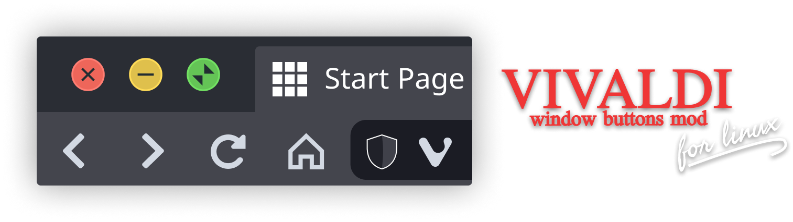

  
  
  <h3 align="center"><b>Mod de botões de janela para o Vivaldi</b></h3>
  
??? <i>"This is a mod exclusively for Linux".</i>

  

  
  
  
  
  
   
  

  

   
    
  <a href="./docs/README-pt_BR.md">Português Brasileiro 🇧🇷</a>

---

 
<h2 id="dependencies"><b>🚧 Dependencies</b></h2>

---
 
 
<h2 id="recommendations"><b>👍 Recommendations</b></h2>

 
---

 
<h2 id="install"><b>🚀 Install</b></h2>

---

 
<h2 id="how-to-use"><b>🤔 How to use ?</b></h2>

---

 
<h2 id="final"><b>🥳 Final</b></h2>

---

 
<h2 id="license"><b>📜 License</b></h2>

Esse projeto esta sob a licença [MIT](./LICENSE)

---

  

 
criado por <a href="https://linkedin.com/in/antonionarcilio">@antonionarcilio</a>

