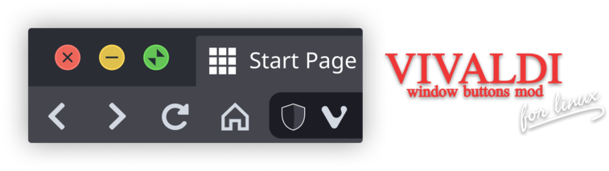
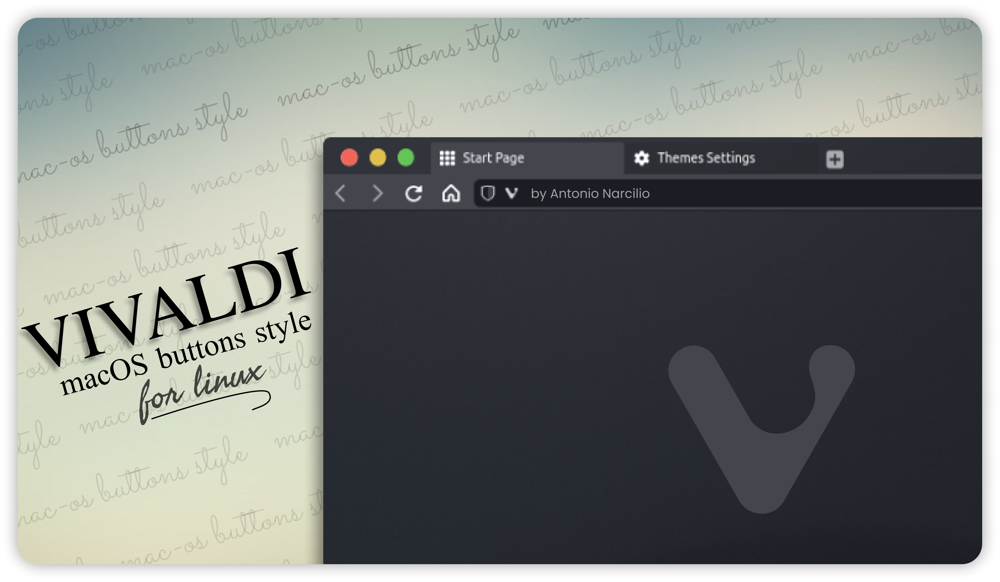
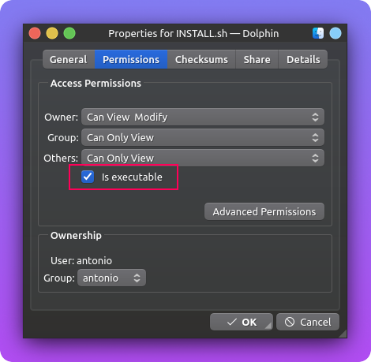
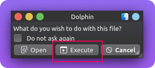
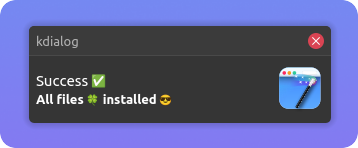
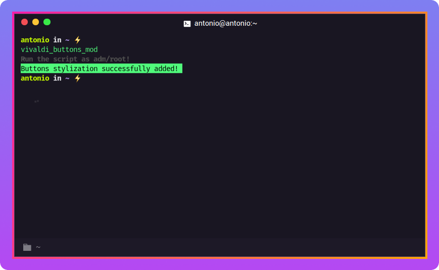
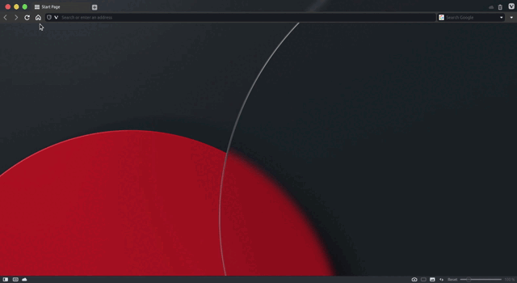

  
  
 <h3 align="center"><b>Window Buttons Mod for Vivaldi Browser</b></h3>
  
This is a shell script where when running it adds a new styling to the Vivaldi browser window buttons, leaving them similar to macOS.<i>"This is a mod exclusively for Linux".</i>

  

  
  
  
  
  
   
  

  

   
    
  <a href="./docs/README-pt_BR.md">Português Brasileiro 🇧🇷</a>

 
<h2 id="dependencies"><b>🚧 Dependencies</b></h2>

For the installation process to run as expected, you must first have the following dependency installed on your machine (PC / Computer) 👇.

<h3><a href="https://apps.kde.org/kdialog/"><b>Kdialog</b></a></h3>

 
  <b>Where is it used?</b>  
  Used in pop-up notifications and dialogs such as:

  > Get superuser/administrator password (only used in installation file).

  > Show messages (pop-up) containing information about the installation process.

 
  <h4><b>How to install ?</b></h4>
  
  First, make sure you have kdialog installed on your machine (if you prefer, the `install.sh` file does this check for you).
  
  ~~~bash
  kdialog --version
  ~~~
  
  > 💡 If returning something other than `kdialog <version_number>` is a sign that you don't have this dependency installed on your machine, if this is exactly your situation, continue with the brief installation process below.

  Briefly, run the following command in the terminal to install the dependency:

  ##### Distros Debian
  ~~~bash
  sudo apt update && sudo apt install kdialog -y
  ~~~  
  ##### Distro Arch Linux
  ~~~bash
  sudo pacman -Sy kdialog
  ~~~

  > 💡 For more, click on the name `kdialog` (in blue) there at the beginning of the thread; where you will be redirected to the app's official page.

 
<h2 id="recommendations"><b>👍 Recomendations</b></h2>
If you prefer, you can modify your browser's appearance settings, making it more visually friendly. Just follow the step by step in this 👉 <a href="https://user-images.githubusercontent.com/49988118/132754809-b0ea11a5-79d7-4f26-acac-c9a70b991da3.mp4
">video 🎬</a>. 

 
<h2 id="install"><b>🚀 Install</b></h2>
  Installation is very simple, just run the install script (`install.sh`) and it will do the rest for you, but pay attention to the initial setup 👇.

 
  <h4><b>Initial setting</b></h4>
  Before running the installation file <i>install.sh</i>, you need permission to run it. There are two ways to go about this process.

  1. Via dolphin file manager (graphical interface):
  Right-click the `install.sh` file and select <kbd> properties </kbd>> <kbd> permissions </kbd> and check the `is executable` box.    
      

  2. Via command line (terminal):

      ~~~bash
      chmod +x ./INSTALL.sh
      ~~~

 
 
  <h4><b>How to use?</b></h4>
  There are also two ways to run the script:  

  1. Via dolphin file manager (graphical interface):
  Double-click the `install.sh` file.    
      

  2. Via command line (terminal):
       ~~~bash
       ./INSTALL.sh
      ~~~

  After running the `install.sh` file, a dialog box asking for the superuser / administrator password will appear, pass the password to proceed with the installation process.    
  

  The script will check if all dependencies are installed, if the return is positive it will continue with the installation process, at the end of the process if everything goes as expected, a pop-up will appear informing you that the installation was successful. Otherwise, a message (pop-up) will appear informing you of the error found.    
  

 

 
 
  <h4><b>What does this script do ?</b></h4>
  This script is to automate the "installation" process of the thumbnail generator
 

 <h4><b>Where will these files be copied to?</b></h4>
The following files will be copied to their respective directories:
 
 <kbd>usr</kbd> > <kbd>share</kbd> > <kbd>pixmaps</kbd>
 
<pre>
.
└── <a href='./icons'>icons</a>
   ├── <a href='./icons/an-alert.svg'>an-alert.svg</a>
   └── <a href='./icons/an-effects.svg'>an-effects.svg</a>
</pre>
 
 
<kbd>usr</kbd> > <kbd>bin</kbd>
 
<pre>
.
└──  <a href='./vivaldi_buttons_mod'>vivaldi_buttons_mod</a>
</pre>
 
<kbd>opt</kbd> > <kbd>vivaldi</kbd> > <kbd>resources</kbd> > <kbd>vivaldi</kbd> > <kbd>style</kbd>
 
<pre>
.
└──  <a href='./buttons_macos.css'>buttons_macos.css</a>
</pre>
 

 
<h2 id="howtouse"><b>🤔 How to use ?</b></h2>
After following all the steps described above, it's time to run the script that will add a new style to Vivaldi window buttons. The only way to do this is through the terminal, using the command described below 👇.
 
~~~bash
sudo vivaldi_buttons_mod
~~~
>⚠️ The script must be run as super user/administrator, otherwise it will return an error.
 

 

 <h4><b>What does this script do ?</b></h4>
 There is a CSS file available in the directory/folder where the Vivaldi browser is normally installed (usually in opt/vivaldi) called 'common.css' which contains certain styles used in the ​​browser interface, what this script will do is add a new style to the end of this 'common.css' file, causing the original style to be 'replaced', leading to the <a href="#final">expected result</a>.

 
>⚠️ When updating the browser to a newer version, you will have to rerun the script as the update causes the `common.css` file to be also updated, thus causing the previously added styling to be undone.

 
<h2 id="final"><b>🥳 Expected result</b></h2>

 
<h2 id="license"><b>📜 License</b></h2>

This project is under license [MIT](./LICENSE)

  

created with ❤️ by <a href="https://linkedin.com/in/antonionarcilio">@antonionarcilio</a>

 
